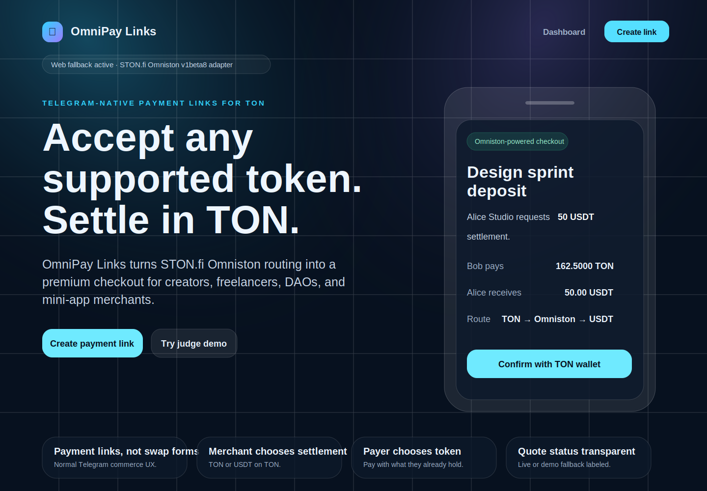

# OmniPay Links

**One-liner:** Accept any supported token, settle in the TON asset you want — payment links powered by STON.fi Omniston.

OmniPay Links is a Telegram Mini App MVP for creators, freelancers, DAOs, community admins, and mini-app sellers who need payment links instead of a swap terminal. A merchant creates an invoice, chooses the settlement asset they want to receive (TON or USDT on TON), and shares a Telegram-native checkout link. The payer opens the link, chooses the supported asset they already hold, requests an Omniston quote, and confirms a TON wallet transaction.

## Preview screenshot



See `docs/telegram-bot-launch.md` for the exact BotFather + Vercel launch checklist.

## Hackathon alignment

The STON.fi Vibe Coding Hackathon Cohort 2 requires a functional app, a clear TON use case, GitHub repo, live URL, Loom demo, and real STON.fi or Wallet in Telegram integration. OmniPay Links targets the STON.fi track with an Omniston v1beta8 adapter and is designed as a Telegram Mini App for the Wallet in Telegram direction.

- **STON.fi track:** Omniston quote/routing/payment adapter is implemented in `src/integrations/omniston/client.ts`.
- **Wallet in Telegram track:** Telegram Mini App runtime, share links, safe-area layout, and TON Connect checkout are implemented in `src/integrations/telegram/webapp.ts` and `src/integrations/ton/wallet.ts`.
- **Important limitation:** the npm registry available in this build environment returned `403 Forbidden` for package installation, including `@ston-fi/omniston-sdk`, `@ston-fi/omniston-sdk-react`, and `@tonconnect/ui-react`. The app therefore ships with a documented adapter layer, a live HTTP quote attempt, a TON Connect browser runtime hook via CDN, and clearly labeled demo fallback quotes when the live Omniston endpoint is unavailable.

## MVP flows

1. **Merchant onboarding**
   - Open the Telegram Mini App or web fallback.
   - Connect a TON wallet when TonConnect UI is available.
   - Enter merchant wallet, invoice title, amount, note, and preferred settlement asset.
   - Generate a shareable `/checkout/:slug` payment link.
   - Copy or share the link in Telegram.

2. **Payer checkout**
   - Open the payment link.
   - Review merchant, invoice amount, requested settlement asset, and expiry.
   - Select a payment asset.
   - Fetch an Omniston v1beta8 quote.
   - See source asset, settlement asset, expected received amount, route, fee, slippage, ETA, status, and confidence.
   - Confirm a TON transaction via TonConnect if the runtime library is loaded; otherwise receive a clearly labeled demo receipt.

3. **Receipt**
   - Show status, merchant wallet, payer wallet, paid asset, received asset, amount, transaction hash, timestamp, and Telegram share action.

4. **Merchant dashboard**
   - Show total invoices, paid invoices, pending invoices, total received, recent invoices, and copy/open actions.

## Tech stack

This repository intentionally avoids installed npm dependencies because the current environment blocks registry access. The implementation is still Vercel-ready and uses:

- TypeScript with strict checking.
- Static HTML/CSS/TypeScript app compiled by `tsc`.
- Telegram WebApp SDK loaded from Telegram.
- TON Connect UI runtime hook loaded from CDN.
- STON.fi Omniston v1beta8 adapter with live HTTP attempt plus transparent demo fallback.
- LocalStorage persistence for the hackathon MVP.
- Runtime config through `public/config.js` for preview/deployment hosts.
- Vercel SPA rewrites through `vercel.json` so checkout/receipt deep links work in production.

## Environment variables

Copy `.env.example` and configure these values for production:

```bash
VITE_PUBLIC_APP_URL=https://your-vercel-domain.vercel.app
VITE_TONCONNECT_MANIFEST_URL=https://your-vercel-domain.vercel.app/tonconnect-manifest.json
VITE_OMNISTON_WS_URL=wss://omniston.ston.fi/ws
VITE_OMNISTON_API_URL=https://omniston.ston.fi
VITE_TONAPI_KEY=
VITE_TELEGRAM_BOT_USERNAME=your_bot_username
```

The current static build reads the public app origin at runtime. Future SDK-based builds can wire these values through a bundler.

## Local setup

```bash
npm install
npm run typecheck
npm run lint
npm run build
npm run dev
```

Open `http://localhost:5173`.

## Telegram Mini App setup

1. Create or open your bot in BotFather.
2. Use BotFather to configure a Mini App / web app button.
3. Set the Mini App URL to your Vercel production URL.
4. Update `public/tonconnect-manifest.json` with the production app URL and icon URL.
5. Set `VITE_TELEGRAM_BOT_USERNAME` in Vercel for documentation/future runtime wiring.
6. Share generated checkout links in Telegram chats, DMs, or channels.

## Live preview

A local production preview is available after building with `npm run preview` at `http://localhost:4173`. For a public judge URL, deploy the same `dist` output to Vercel using the steps below. This environment does not include Vercel auth/CLI, so a durable public Vercel URL must be created from your Vercel account.

## Vercel deployment

1. Push this repo to GitHub, ideally `darajiola/omnipay-links`.
2. Import the repository in Vercel.
3. Set build command: `npm run build`.
4. Set output directory: `dist`.
5. Add environment variables from `.env.example`.
6. Update `public/config.js` and `public/tonconnect-manifest.json` with the production app URL/domain.
7. Deploy to production.
8. Paste the live production URL into `docs/hackathon-submission.md`.

## Submission checklist

- [x] Project name: OmniPay Links.
- [x] One-liner and short description.
- [x] Functional local app.
- [x] TON wallet integration path.
- [x] STON.fi Omniston v1beta8 adapter path.
- [x] Telegram Mini App runtime support.
- [x] GitHub-ready repository.
- [ ] Live production URL.
- [ ] Loom demo.
- [ ] Final submission form.
